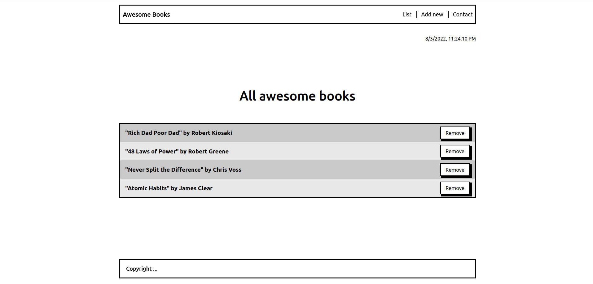
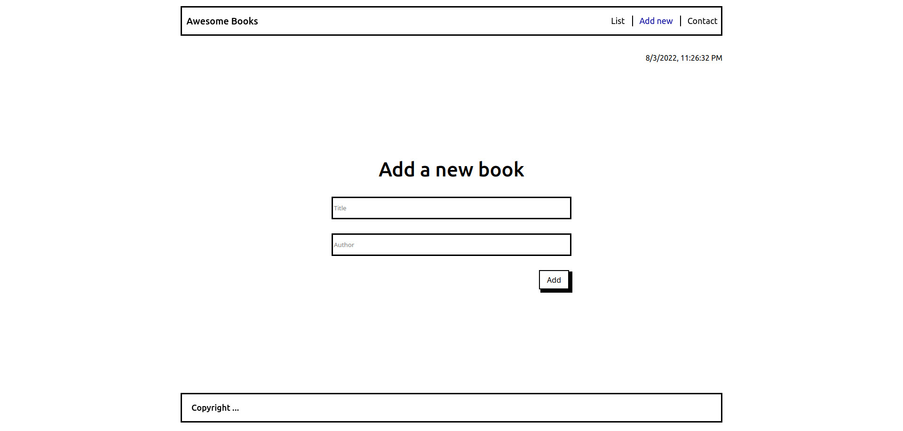

# Project Name

> Awesome Books

# Description

> A simple website containing a list of books that can be modified through adding or removing a book
> Re-create Awesome books app using ES6 syntax
> Divide the code into modules


## Built With

- HTML
- JavaScript
- CSS

## Screenshots




## Getting Started

This is an example of how you may give instructions on setting up your project locally. Modify this file to match your project, remove sections that don't apply. For example: delete the testing section if the currect project doesn't require testing.

To get a local copy up and running follow these simple example steps.

### Prerequisites
 - IDE(code editor) like: **Vscode**, **Sublime**, etc.  
 - [Git](https://www.linode.com/docs/guides/how-to-install-git-on-linux-mac-and-windows/)

### Setup
  1. Download the **Zip** file or clone the repo with: ```bash git clone [https://github.com/Tadessejemal1/Awesome-books.git-  https://github.com/Tadessejemal1/Awesome-books.git/)
  2.  ``` To access cloned directory run: ```bash cd/Single-page-website ``` 
  3. Open it with the live server or just  open the "index.html" file with any browser

### Usage
  - First you would find the list of books in the "List" section empty.
  - To add a book to the list .. navigate to the "Add new" section & add the "title"   and the "author", then click Add.
  - To remove a book from the list click teh remove button displayed next to the book in the "List" section.

## Authors

## 👤 Tadesse J.

  > GitHub: https://github.com/Tadessejemal1 
  > 
  > LinkedIn: https://www.linkedin.com

## 🤝 Contributing

Contributions, issues, and feature requests are welcome!

Feel free to check the [issues page](../../issues/).

## Show your support

Give a ⭐️ if you like this project!

## Acknowledgments

- Hat tip to anyone whose code was used
- Inspiration
- etc

## 📝 License

This project is [MIT](./MIT.md) licensed.
